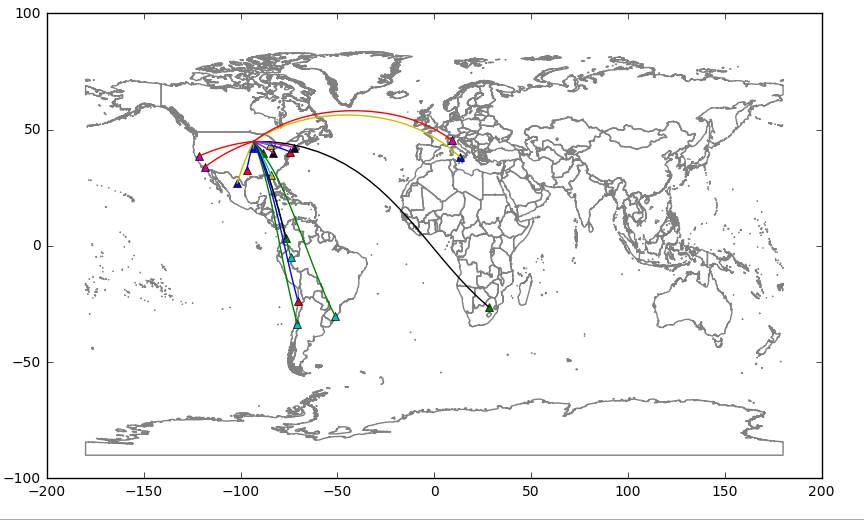

# Spatial Data Analysis with PySAL @NARSC2016

**Serge Rey** <sjsrey@gmail.com>

* [Installation instructions](install.md)

## Schedule

* 8:00-10:00
  * Overview of PySAL and workshop
  * Introductions
  * Installation
  * Jupyter notebooks
  * Python primer
* 10:00-10:30
  * Coffee Break
* 10:30-12:30
  * Spatial data processing
  * Choropleth mapping and geovisualization
  * Spatial weights
* 12:30-1:30
  * Lunch
*  1:30-3:00
  * Global spatial autocorrelation
  * Local spatial autocorrelation
  * Spatial inequality analysis
* 3:00-3:30
  * Coffee Break  
* 3:30-5:00
  * Geodemographics and regionalization
  * Spatial dynamics
  * Spatial regression
