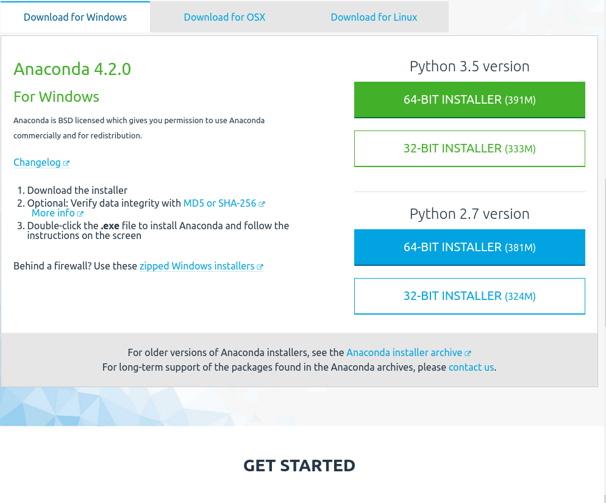
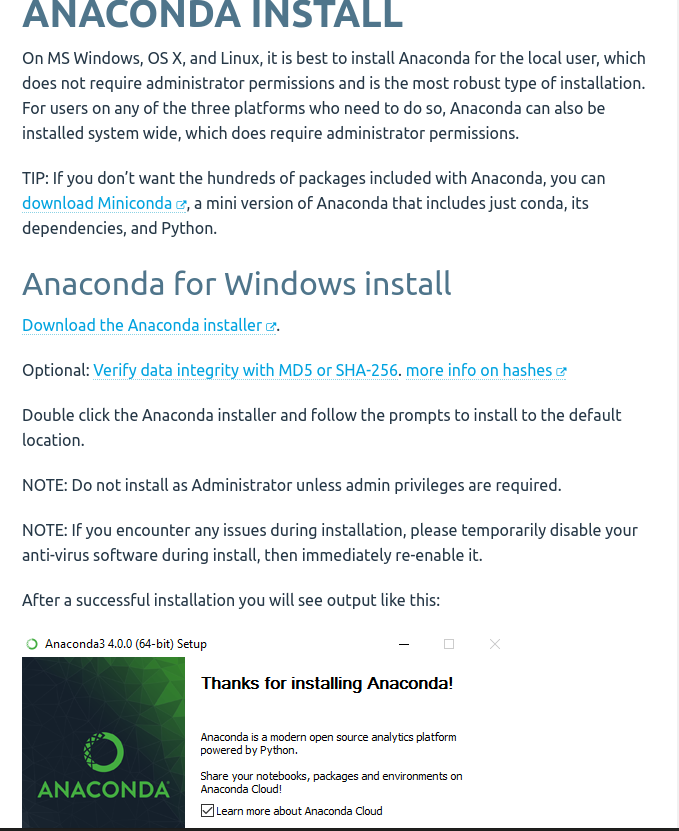
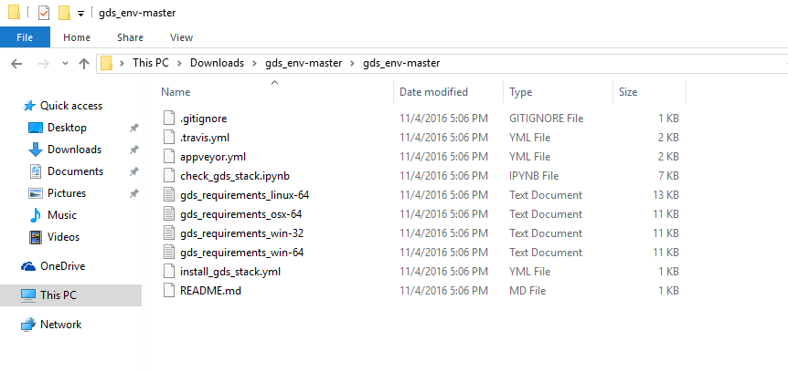
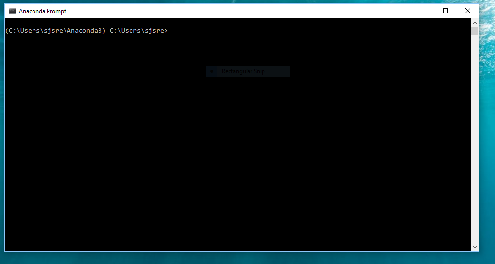
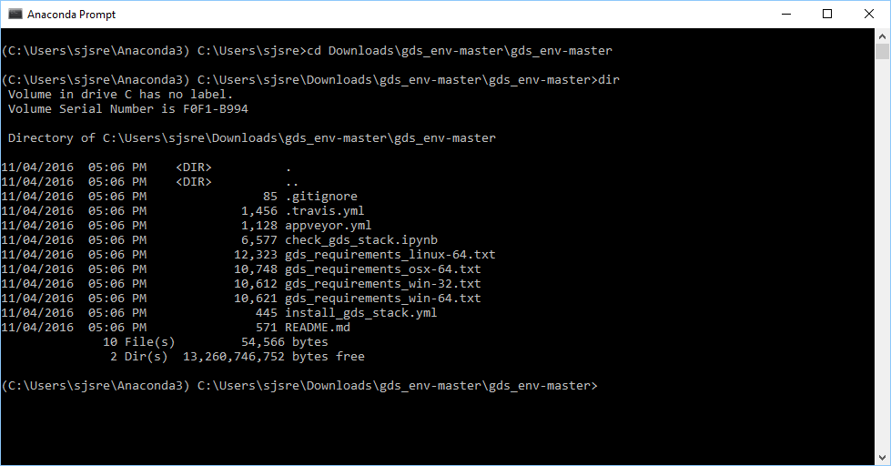
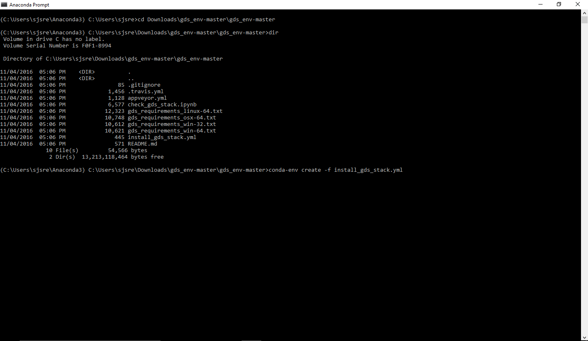
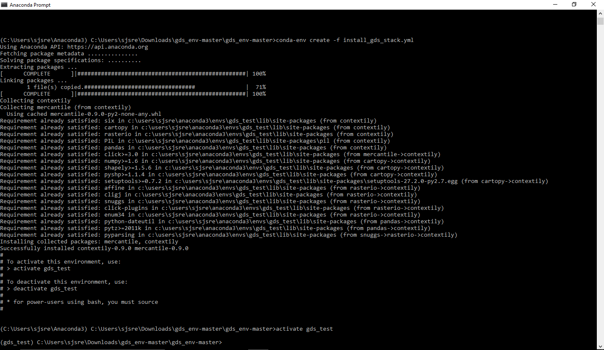
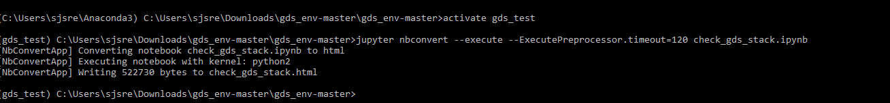
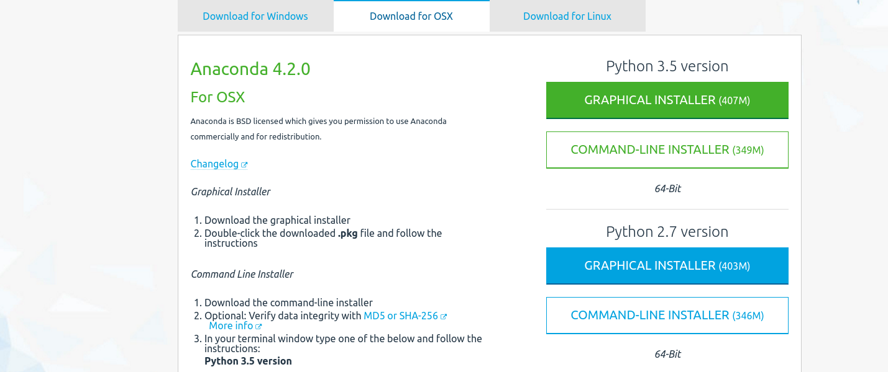

# Install Instructions: PySAL @NARSC 2016


 Before you embark on your travels to NARSC, I would ask you to setup your own laptop with the required packages for the workshop. These are fairly large downloads so it would be more efficient for each participant to grab these packages before travel, rather than our workshop overtaxing the hotel network.

The downloads are on the order of 400megs so the time required for downloading and installation may be 10-15 minutes, depending on your connections.

Below I give the instructions for different operating systems.

Should you have any questions please feel free to contact me at: <sjsrey@gmail.com>


I will also bring installers on usb flash drives. And there is an option to use Virtualbox, if that is your thing. (See below)


## Installation Under Windows

### 1. Download the [Python 2.7 version of Anaconda Distribution Installer](https://repo.continuum.io/archive/Anaconda2-4.2.0-Windows-x86_64.exe)



### 2. Read the [Anaconda installation instructions](https://docs.continuum.io/anaconda/install)



### 3. Download the [setup archive](  https://github.com/sjsrey/narsc16/archive/master.zip)


### 4. Extract the archive from step 3 to a working directory



### 5. From the Windows start menu select `Anaconda3 (64-bit)` and then `Anaconda Prompt`



### 6. Navigate to the archive extraction directory



### 7. Create our conda environment for the workshop
The command is:

    conda-env create -f install_gds_stack.yml




### 8. Activate your environment
    activate gds




### 9. Install Additional packages

	pip install folium
	pip install geojson
	conda install -c bokeh datashader


### 10. Test your environment

    nbconvert --execute --ExecutePreprocessor.timeout=120 check_gds_stack.ipynb





If your screen looks like the previous image, you are good to go. If not, read through the directions again closely. If you still have issues please email <sjsrey@gmail.com>
.
### Troubleshooting under Windows

If you receive a message that the downloads have timed out, the fix is as
follows:

```
(gds) deactivate
$ conda remove -n gds --all
``` 
Respond `Y` when prompted.

Then repeat steps 7-10 above and the download should pick up where it left off.


## Installation Under Mac OS X


### 1. Download the [Python 2.7 version of Anaconda Distribution Installer](https://www.continuum.io/downloads#osx)




### 2. Read the [Anaconda installation instructions](https://docs.continuum.io/anaconda/install)


### 3. Download the [setup archive](  https://github.com/sjsrey/narsc16/archive/master.zip)


### 4. Start a terminal and move to the archive extraction directory
```
$ conda-env create -f install_gds_stack.yml
```

### 5. Activate environment
```
$ source activate gds
```

### 6. Install additional packages

	(gds) pip install folium
	(gds) pip install geojson
	(gds) conda install -c bokeh datashader


### 7. Test environment

```
(gds) jupyter nbconvert --to markdown --execute --ExecutePreprocessor.timeout=480 check_gds_stack.ipynb
(gds) narsc16/git - [install●] » jupyter nbconvert --execute
--ExecutePreprocessor.timeout=120 check_gds_stack.ipynb
[NbConvertApp] Converting notebook check_gds_stack.ipynb to html
[NbConvertApp] Executing notebook with kernel: python2
[NbConvertApp] Writing 519599 bytes to check_gds_stack.html
(gds) 
```

If your screen looks like the previous image, you are good to go. If not, read through the directions again closely. If you still have issues please email <sjsrey@gmail.com>
.

### Troubleshooting Under Mac OS X

If you receive a message that the downloads have timed out, the fix is as
follows:

```
(gds) source deactivate
$ conda remove -n gds --all
``` 
Respond `Y` when prompted.

Then repeat steps 4-7 above and the download should pick up where it left off.


## Installation Under Linux

If you are using Linux, two things:

1.  Awesome
2.  I'm assuming you know how to do this ;-> If that is a bad assumption, just email me.


## VirtualBox Option

For those of you who would rather have a one-stop shopping virtual machine with all packages preinstalled, I will bring a custom vm with me to the workshop. To be able to use this, please install the [VirtualBox application](https://www.virtualbox.org/wiki/Downloads) for your operating system prior to traveling to NARSC.
